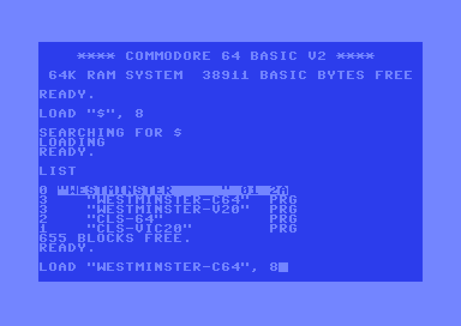
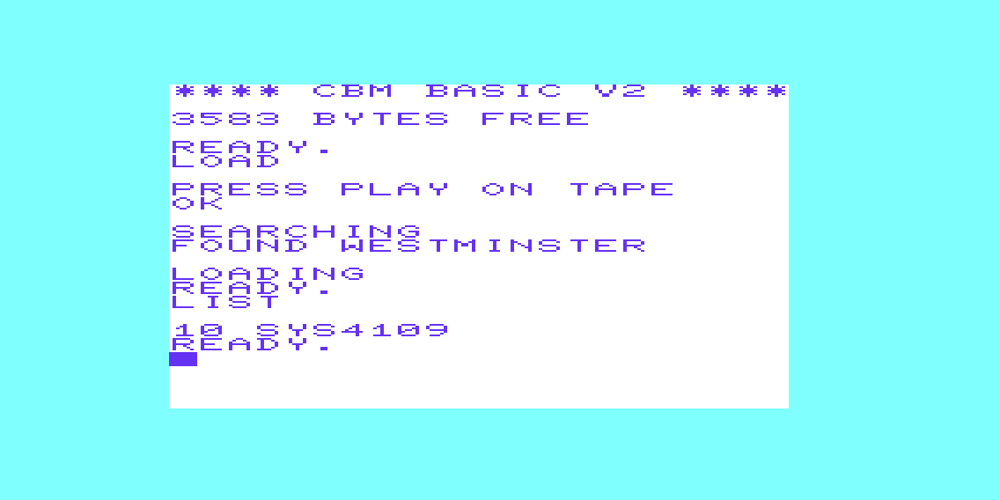
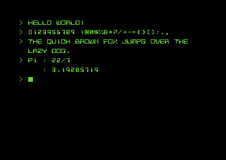
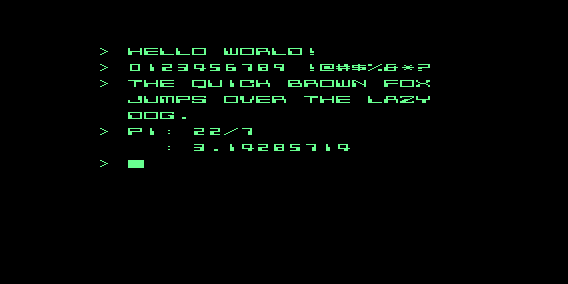

# Westminster Typeface — Commodore VIC-20 & Commodore 64


<table align="center">
  <tr>
    <td align="center">
      <p><sub><b>Commodore 64</b></sub></p>
      
    </td>
      <td align="center">
      <p><sub><b>Commodore VIC-20</b></sub></p>
      
    </td>
  </tr>
  <tr>
  <td align="center">
      <br>
      
    </td>      
      <td align="center">
      <br>
      
    </td>
  </tr>
</table>

Tiny, BASIC-launchable `.prg` installers that load a custom 8×8 **Westminster** typeface into the Commodore machine's custom character sets. **Westminster** typeface is the 1960s MICR / "computer cheque" face. There is a separate installer for the **Commodore 64** and unexpanded **Commodore VIC-20**.

Each installer copies a character set into RAM, overlays the redefined Westminster glyphs, repoints the machine's video chip at the RAM charset, and `RTS`-es back to BASIC so the new glyphs persist at the `READY.` prompt. The installers print nothing, hook no interrupt, and leave no resident code.

## 📑 Table of Contents

- [📥 Download and run](#-download-and-run)
- [🧰 Dependencies](#-dependencies)
- [🔧 Setup](#-setup)
- [🔨 Build](#-build)
- [🚀 Run](#-run)
- [🔤 Redefining a glyph](#-redefining-a-glyph)
- [📁 Repository layout](#-repository-layout)
- [📄 Licence](#-licence)

## 📥 Download and run

Download the prebuilt binaries from the [Releases](../../releases) page, no toolchain needed, only real hardware or an emulator (VICE, etc). To build from source, see [Build from source](#-dependencies) below.

| File | For | What it is |
|------|-----|------------|
| `westminster.d64` | C64 **and** VIC-20 | Disk image holding all four programs below |
| `westminster.tap` | VIC-20 | Cassette image of the VIC-20 installer |
| `westminster-c64.prg` | C64 | Typeface installer |
| `westminster-vic20.prg` | VIC-20 (unexpanded) | Typeface installer |
| `cls-64.prg` / `cls-vic20.prg` | C64 / VIC-20 | Utility program that sets the screen, border, and text color. |

**Run an installer in VICE (autostart):**

```
x64sc -autostart westminster-c64.prg
xvic -memory none -autostart westminster-vic20.prg
```

The VIC-20 cassette image autostarts the same way: `xvic -memory none -autostart westminster.tap`.

**From the disk image** (`westminster.d64` serves both machines): attach it as drive 8, then on a **C64**:

```
LOAD"WESTMINSTER-C64",8
RUN
```

or on a **VIC-20**:

```
LOAD"WESTMINSTER-V20",8
RUN
```

The `CLS-64` and `CLS-VIC20` utility programs load the same way (e.g. `LOAD"CLS-64",8` then `RUN`). The two utility programs are unrelated to the `WESTMINSTER` typeface program. They are used purely to set the border, screen and text color for aesthetic entertainment.

## 🧰 Dependencies

| Tool | Purpose | Where |
|------|---------|-------|
| Kick Assembler (`KickAss.jar`) | Assembles the 6502 sources into `.prg` | <http://theweb.dk/KickAssembler/> |
| Java (JRE/JDK) | Runs `KickAss.jar` | any JRE/JDK on `PATH` |

No Python or other toolchain is needed. The font table ships as ready-to-assemble source.

## 🔧 Setup

Before building, you need to tell the scripts where you installed Kick Assembler, Java (see [Dependencies](#-dependencies)), and VICE. You do this once, in a small `config.bat` file.

First, copy the committed template to create your own local copy:

```
copy config.example.bat config.bat
```

Then open `config.bat` and set these three variables to match your machine:

| Variable | Set it to |
|----------|-----------|
| `KICKASS_JAR` | Absolute path to your `KickAss.jar` — e.g. `C:\tools\kickass\KickAss.jar` |
| `JAVA_EXE` | The Java launcher — leave it as `java` if a JRE/JDK is on your `PATH`, otherwise the full path to `java.exe` |
| `VICE_HOME` | Your VICE install folder, the one containing `bin\x64sc.exe` and `bin\xvic.exe` — e.g. `C:\tools\vice` |

`config.bat` is git-ignored, so your local paths stay on your machine and are never committed.

## 🔨 Build

From the project root:

```
build-c64.bat    -->  dist\westminster-c64.prg
build-vic20.bat  -->  dist\westminster-vic20.prg
```

Each script assembles the matching main and writes a `.prg` under `dist\` (created automatically).

## 🚀 Run

Builds, then launches the installer in VICE:

```
run-c64.bat    -->  x64sc
run-vic20.bat  -->  xvic -memory none  (unexpanded)
```

After it loads, the installer returns to BASIC; type at the `READY.` prompt to see the Westminster glyphs.

## 🔤 Redefining a glyph

The whole font lives in **`src/shared/charset.asm`** — one self-contained source file shared by both machines. To change a glyph, edit its `.byte` record directly; no extra tooling is involved.

Each record is **9 bytes**: a screen-code byte followed by **eight** packed glyph bytes (top row first; MSB-left, so column 0 is bit 7). Above every record is an 8-row picture of the shape those bytes draw, which is a comment guide only; the `.byte` values are what assemble. For example:

```
        //   .XXXXX..
        //   .X...X..
        //   .X...X..
        //   XXXXXXX.
        //   XX....X.
        //   XX....X.
        //   XX....X.
        //   ........
        .byte $01, $7C, $44, $44, $FE, $C2, $C2, $C2, $00   // 'A'  screen $01
```

To pack a row, read it left to right: `X` = 1, `.` = 0, MSB first (`.XXXXX..` → `%01111100` → `$7C`). If you add or remove whole records, update `WESTMINSTER_OVERLAY_COUNT` at the top of the file to match. Rebuild with `build-c64.bat` / `build-vic20.bat`.

## 📁 Repository layout

```
westminster-typeface/
├── README.md             # this document
├── LICENSE               # MIT License
├── build-c64.bat         # build entry points (assemble → dist\*.prg)
├── build-vic20.bat
├── run-c64.bat           # run entry points (build, then launch in VICE)
├── run-vic20.bat
├── config.example.bat    # toolchain-path template (copy to config.bat)
└── src/                  # all Kick Assembler sources
    ├── c64/              # C64 installer main + platform constants
    │   ├── westminster-c64.asm
    │   └── platform-c64.asm
    ├── vic20/            # VIC-20 installer main + platform constants
    │   ├── westminster-vic20.asm
    │   └── platform-vic20.asm
    └── shared/           # shared macros + the Westminster font table
        ├── macros.asm
        └── charset.asm
```

## 📄 Licence

Released under the [MIT License](LICENSE) — Copyright © 1989 Rohin Gosling.
